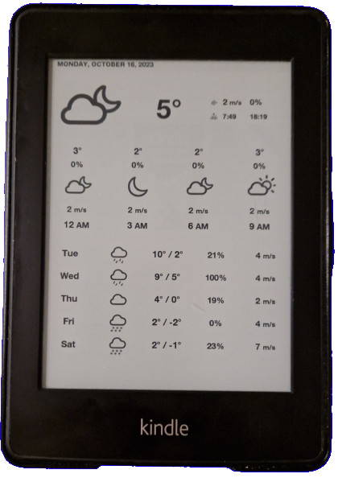

# Paper Weather

Paper Weather turns old Kindle e-readers into an e-ink weather dashboard.

⚠️ This project is WIP. It's not really in a state to be used by anyone else yet.

## Setup

* Find an old Kindle, jailbreak it and install [WebLaunch](https://github.com/PaulFreund/WebLaunch).
* Host this code somewhere (locally without HTTPS, as old Kindles have issues with newer TLS standards)
* Point the browser to `http://<yourip>:3000/weather?lat=<lat>&lng=<lng>`

## TODO

- [ ] Find out why my Kindle turns off
- [ ] Mounting to a frame
- [ ] Kindle setup instructions
- [ ] Create Docker image
- [ ] Write deploy instructions
